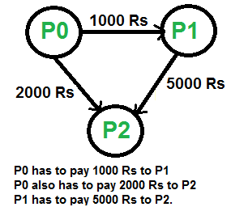
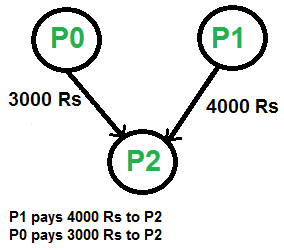

# Minimising Cashflow
## Introduction
The project simplifies the cashflow occuring in a complex system of transactions. It aims to solve the complexity of splitting bills and expenses among friends, family and groups. It allows you to manage your expenses in a group, minimises the number of transactions required to remove your debts, and provides a way to clear the maximum debt with your existing balance.

### Example
Before minimising the cashflow

After minimising the cashflow

## Features
It has 2 parts:

### Group management
1. Add people to the group
2. Update the amount of the transaction between people
3. List all the people

### Functions
1. Minimising cashflow
2. Clear maximum debts with the given balance 
(optional: can set priority on which debts to clear first)

## Datastructures and Algorithms Used
File handling is used for the Group Management
For functions, graph (adjacency matrix) is used to store the transaction amounts

Minimising cashflow uses greedy algorithm
Clearing maximum debts uses greedy algorithm